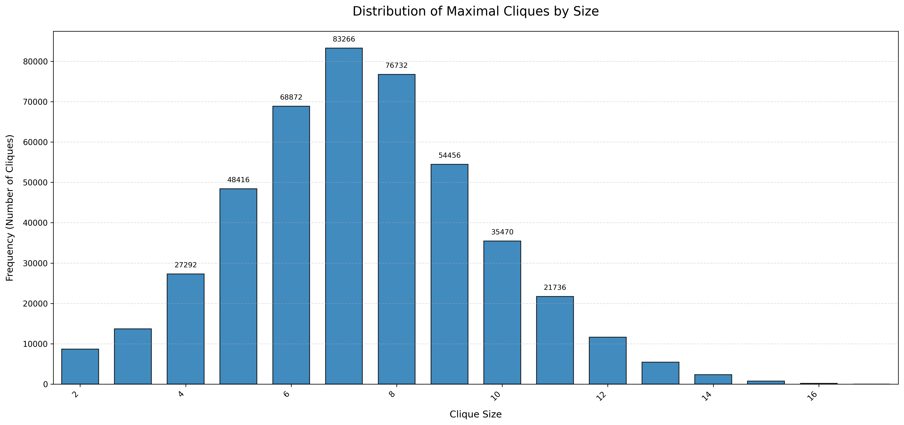
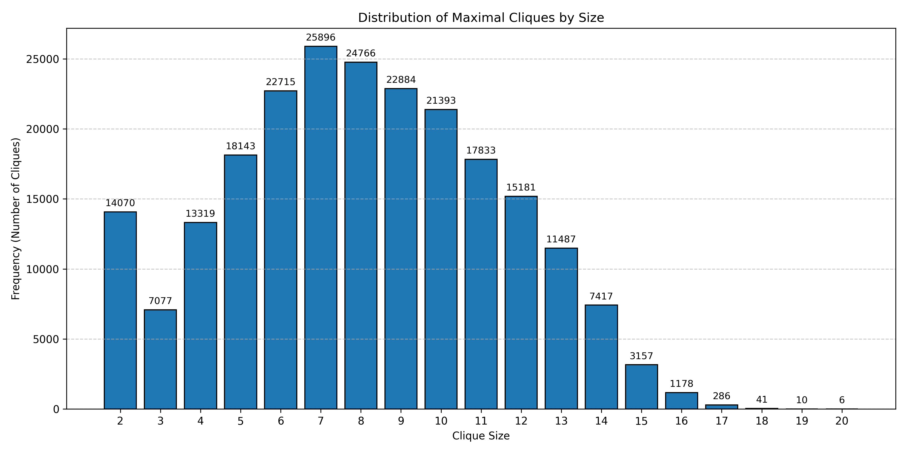
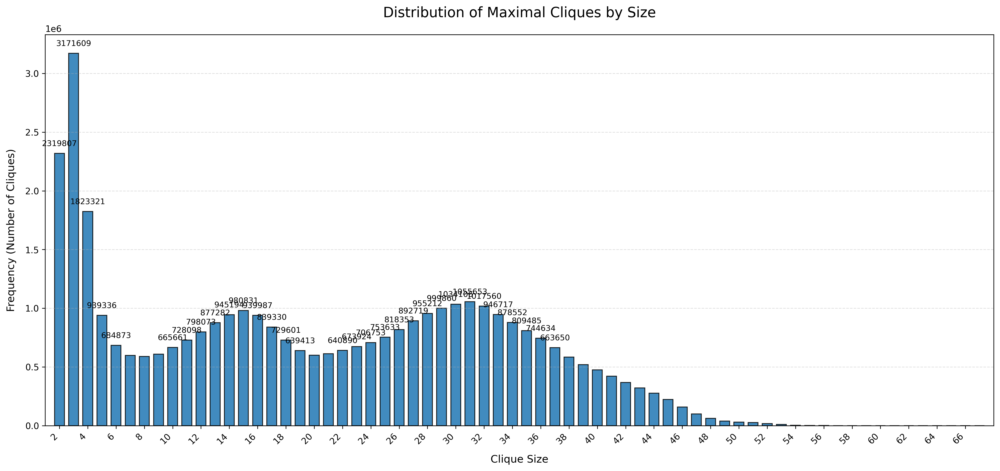
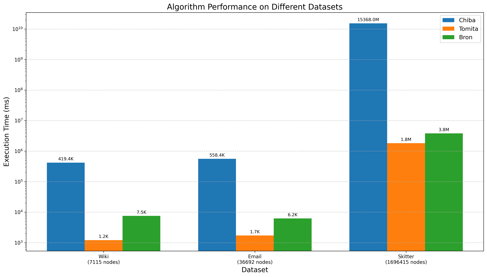
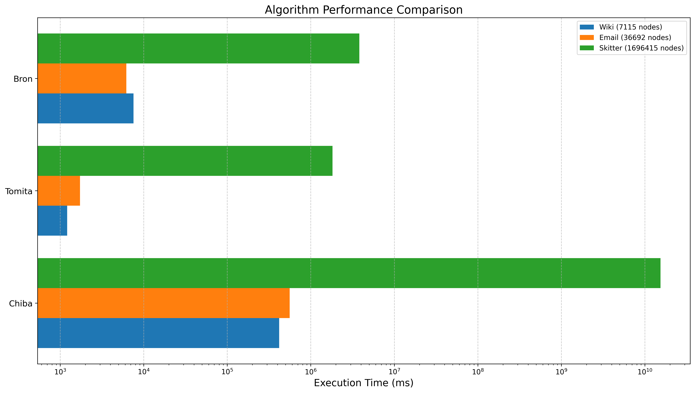
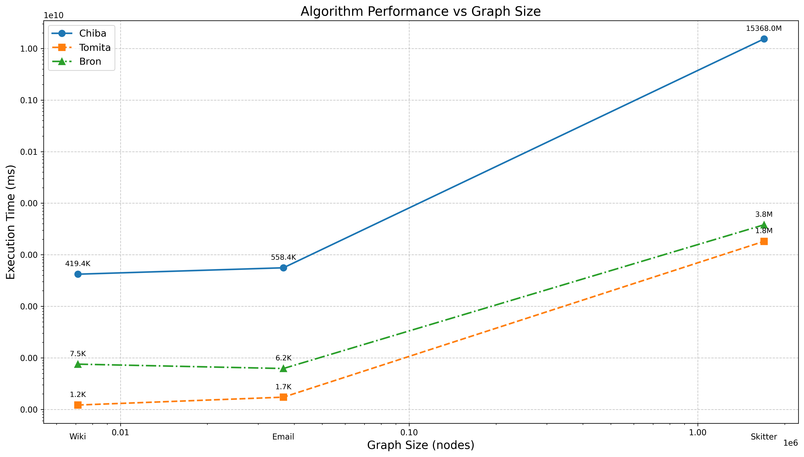

# Comparison

## Assumptions

We skip 1-sized cliques as they are trivial.

By excluding 1-sized cliques across all algorithms, we ensure a fair performance comparison focused on the algorithms' ability to find non-trivial maximal cliques.

## Time Complexities

### Chiba

#### Preprocessing

-   Sorting vertices by degree: O(n log n)
-   Vertex renumbering: O(n + m)
-   Creating new adjacency lists: O(m)

#### UPDATE

The UPDATE function is called recursively to enumerate all maximal cliques. For each vertex i:

##### Set Operations

Computing intersection and difference: O(|C| + |adj[i]|) as it uses efficient linear-time merge of sorted collections

##### Pruning Conditions

-   First pruning check: O(|adj[i]|)
-   Second pruning check (with FLAG): O(p × degree), where p is the size of the difference set
-   Final pruning verification: O(n)

#### Worst-Case Time Complexity

O(3^(n/3)), coming from:

-   Moon-Moser graphs: up to 3^(n/3) maximal cliques
-   Each recursive call explores two branches (include or exclude)
-   Recursion depth can reach n

#### Space Complexity

-   Adjacency lists: O(n + m)
-   Recursion stack: O(n) in worst case
-   Auxiliary arrays S and T: O(n)
-   Temporary sets and vectors: O(n)

### Tomita

#### EXPAND

EXPAND Function depends on

-   Number of recursive calls
-   Operations within each call
-   Pivot selection strategy

##### Set Operations

```cpp
vector<int> intersection(const vector<int>& a, const vector<int>& b) {
vector<int> result;
set_intersection(a.begin(), a.end(), b.begin(), b.end(), back_inserter(result));
return result;
}

vector<int> difference(vector<int> a, const vector<int>& b) {
vector<int> result;
set_difference(a.begin(), a.end(), b.begin(), b.end(), back_inserter(result));
return result;
}
```

Both operations are O(|a| + |b|) since the vectors are sorted.

##### Pivot Selection

```cpp
    for (int u : SUBG) {
    vector<int> intersection_result = intersection(cand, G[u]);
    if ((int)intersection_result.size() > max_size) {
        max_size = intersection_result.size();
        pivot = u;
    }
}
```

-   Time complexity: O(|SUBG| × (|cand| + max degree))
-   For each vertex, we compute the intersection between candidate set and its adjacency list
-   This selection process is crucial for pruning the search tree

##### Recursive Branching

```cpp
for (int q : ext) {
    Q.push_back(q);
    vector<int> cand_q = intersection(cand, G[q]);
    vector<int> subg_q = intersection(SUBG, G[q]);

    EXPAND(G, cand_q, subg_q);

    Q.pop_back();
    cand.erase(remove(cand.begin(), cand.end(), q), cand.end());
    fini.push_back(q);
}
```

-   `cand.erase(remove(...))` is O(|cand|)
-   Each recursive call has reduced sets cand_q and subg_q
-   The pivoting strategy minimizes |ext|, reducing branching factor

#### Overall Time Complexity

The worst-case time complexity is **O(3^(n/3))**, where n is the number of vertices, matching the theoretical limit for maximal clique enumeration.

For this our implementation:

1. The pivot selection is optimized but still takes O(n × d) time per recursion level
2. The set operations are using standard library functions with O(n) complexity
3. The dynamic set management using `cand.erase(remove(...))` has an additional overhead

#### Space Complexity

-   O(n) for recursion stack depth
-   O(n) for the current clique (Q)
-   O(n²) for graph representation (adjacency lists)
-   O(k) for clique distribution map, where k is the number of different clique sizes

The overall space complexity is O(n²).

### Bron

#### Components

1. `find_order` - Degeneracy Ordering
   Uses a bucket-based algorithm to find a degeneracy ordering
   Time complexity: O(n + m) where n is the number of vertices and m is the number of edges
2. `bron_kerbosch_pivot` - Core Recursive Function
   Worst-case time complexity for the basic Bron-Kerbosch: O(3^(n/3)) which is optimal for listing all maximal cliques
   Pivot selection improves the average case but doesn't change the worst-case bound
3. `find_pivot_sorted` - Pivot Selection
   For each candidate pivot, checks connections to vertices in P
   Time complexity: O(|P| + |X|) \* Δ where Δ is the maximum degree
4. `set_intersection_with_adj` - Set Intersection
   Uses binary search to find common elements
   Time complexity: O(|adj| \* log(|vec|))

#### Overall Complexity

Using degeneracy ordering as implemented in bron_kerbosch_modified provides a time complexity bound of O(d × 3^(d/3) × n), where:

-   d is the degeneracy of the graph (the maximum value of the minimum degree in any subgraph)
-   n is the number of vertices

For sparse graphs where d<< n, this significantly improves on the O(3^(n/3)) bound.

#### Space Complexity

-   Storage for the graph: O(n + m)
-   Recursion stack depth: O(n) (worst case)
-   Various temporary sets (P, R, X): O(n) each

The total space complexity is O(n + m).

## Results

The following graphs show the results obtained from the 3 algorithms

### Wiki Dataset



### Email Dataset



### Skitter Dataset



## Performance

The following graphs help to visualize the performance of the 3 algorithms




